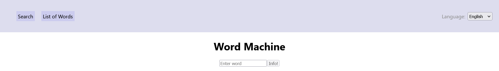

# Word Machine

Translate and automatically save Words in both English and German.

This App was built with Microservice Architecture in mind. It uses Sled-Db, which is an embedded database.

## Features

- Support both English and German.
- Quickly fetch Context for a Word you don't know such as
   - Definition
   - Synonyms
- Quickly switch between languages

## Setup and Install

### Backend

1. `cargo build`
2. `cargo run --bin data`
3. `cargo run --bin fetching`

### Frontend

1. `cd web`
2. `npm install`
3. `npm run start`

Now visit `http://localhost:3000` in your preferred browser, and you're good to go.
